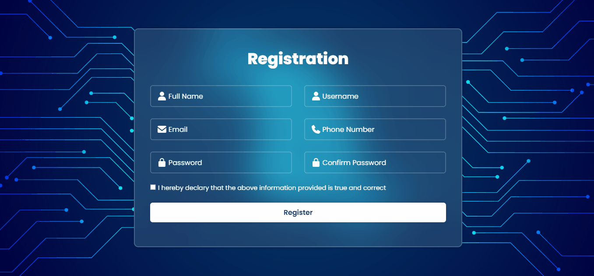
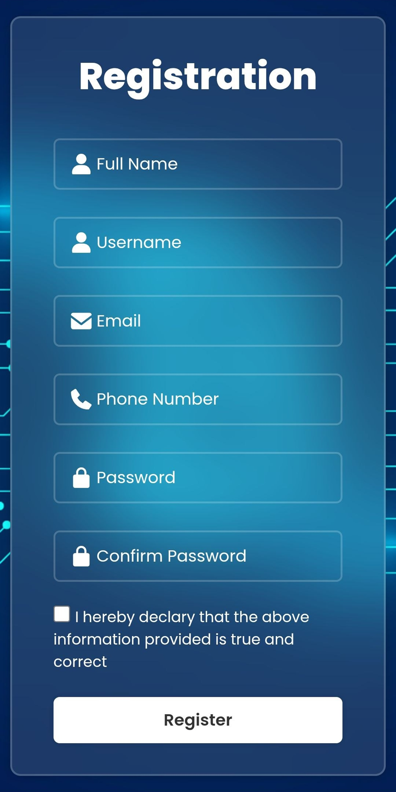

# 📝 Modern Responsive Registration Form

<p align="center">
  
</p>

---

### 🌟 Overview
This project is a clean, glassmorphic **Registration Form** designed with a focus on modern UI/UX principles. It utilizes **CSS Backdrop-filter** for the blur effect and **Inline SVGs** for optimized icon rendering, ensuring a fast and lightweight user experience.

The icons are sourced from [Boxicons](https://boxicons.com/) and integrated as inline SVG code for maximum portability.

[📺 Watch Live Demo](https://github.io](https://juniordevelopper.github.io/Registration-Form-in-HTML-CSS/)

---

### 🎨 Visual Preview


| 🖼️ Desktop View | 📱 Mobile View |
| :---: | :---: |
|  |  |
| *Wide screen layout with dual columns* | *Fully responsive single column layout* |

---

### 🚀 Key Features
- 💎 **Glassmorphism Design:** Beautiful semi-transparent background with a high-quality blur effect.
- ⚡ **Optimized SVGs:** Custom inline SVG icons from Boxicons, eliminating external dependencies.
- 📱 **Mobile Responsive:** Built with **Media Queries** and `dvh` units for a perfect fit on all devices (including Notch-display phones).
- 🎨 **Modern Typography:** Uses Google Fonts (Poppins) for a professional and readable interface.

---

### 📂 File Structure
```bash
project/
├── index.html       # Clean HTML5 structure
├── main.css         # Modern CSS with Flexbox and Media Queries
├── main.js          # JavaScript (ready for validation logic)
└── assets/          # Project assets folder
    ├── images/      # Background images, screenshots, and demo gif
    └── icons/       # Local SVG icon storage for reference
